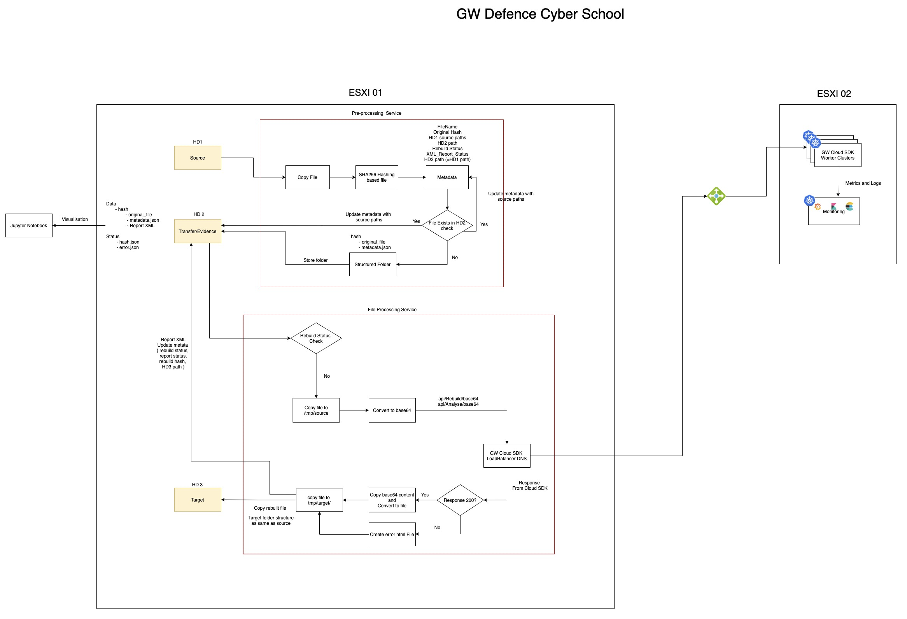

# cdr-plugin-folder-to-folder

# Architecture

# Setup

- Create virtualenv
- Run `pip install -r common_settings/requirements.txt`

# Services
 
## Pre-Processing

- Run `pytests -v tests`

- Run as Fast API  `uvicorn pre_processing.Pre_Processor:app --reload`

- HD1 --> `test_data/hd1`,  HD2 --> `test_data/hd1`

- Open http://localhost:8000/process

=======
**Repo Workflows**

## Project 

- This project aims to create a deployment that is able to process **1TB** of unique unsafe files, shared on the harddrive. 
- Implementation should pick up these files and process them via Rebuild engine in a deployment based on 2 ESXi servers.

## Arhitecture 

- Workflow cluster
- Worker cluster
- Load balancer
- Monitoring
- 3 Harddisks (source, evidence and target)

## Flow diagram

## Data mapping

